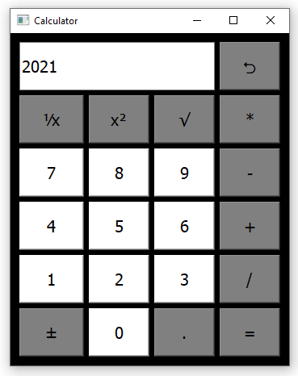
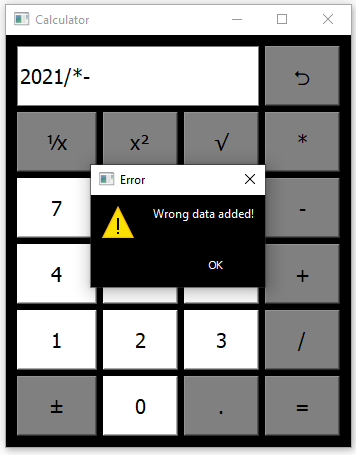
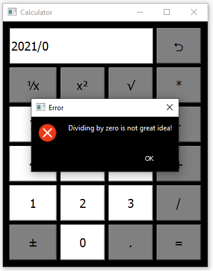

# Calculator

## Table of contents
* [General info](#general-info)
* [Screenshots](#screenshots)
* [Technologies](#technologies)
* [Setup](#setup)
* [Features](#features)
* [Status](#status)
* [Contact](#contact)

## General info
Object-oriented calculator application made with PyQt5. Converted to .exe using cx-Freeze

## Screenshots

## Technologies
* Python 3.8.1
* PyQt5 5.15.2
* cx-Freeze 6.5.3
* idna 3.1
## Setup
To run app you will need to:
* clone this repository to your computer or unpack .zip file in chosen directory
* go to YOUR_DIRECTORY\PyQt5-Calculator-master\main.py\exe\exe.win-amd64-3.8
* double-click main.exe
To install app:
* run IDE or command line
* command in IDE to install demanded packages:
> pip install -r requirements.txt
* type "python YOUR_DIRECTORY\PyQt5-Calculator-master\main.py"

## Features
List of features ready:
* Basic math operations (mostly proceeded by eval() function)
* Functional GUI

## Status
For further development.

## Contact
Created by [@matedawid](https://linkedin.com/in/matedawid) - if you have any questions, just contact me!